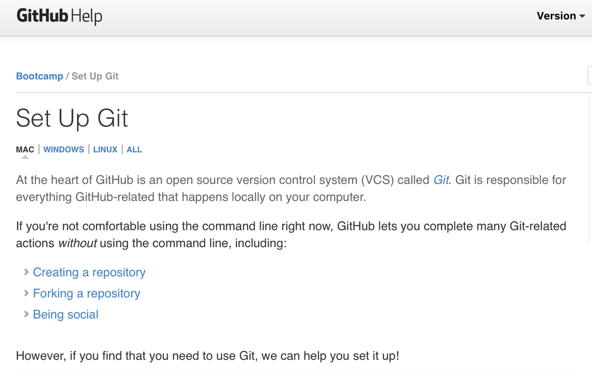

<!--
.. title: Set Up
.. slug: set-up
.. date: 2016-10-17 04:27:01 UTC-07:00
.. tags: 
.. category: 
.. link: 
.. description: 
.. type: text
-->

Conference wifi can be spotty at times. If you are able to install
these items before Open Source Day, that would be great. If you are not
able we'll have a way for you to do so at the event.

## Editor

You will need to have a code editor installed on your system. There are
many available that are open source. Two user friendly editors are:

- [Atom](https://atom.io)
- [Visual Studio Code](https://code.visualstudio.com/)

## GitHub and git

[GitHub Help pages](https://help.github.com)

1. Create a [GitHub account](https://help.github.com/articles/set-up-git/)
   if you do not already have one.

   
   
2. Make sure git is installed on your system.
3. From the command line (terminal), enter `git --version`. If git is
   installed on your system and its PATH, it will display git's version.
   
   
## Command line (Terminal)

## Jupyter Notebook

1. Download the Anaconda installer for your operating system.

2. Run the installer.

---

Work in process:

## Goals

- Learn
- Gallery of Humanitarian Notebooks
  * Education - teaching women; access to technical resources; open data
  * Mapping - safe routes, open data community resources
  * Curate existing notebooks on humanitarian causes
- Open Source Day 2017

## Materials

- [Anaconda](https://www.continuum.io/downloads)
- GitHub account
- Git installed on your system
- Basic command line
- Basic git commands

## Resources for mentors

- [You can git!](http://www.slideshare.net/willingc/yes-you-can-git)